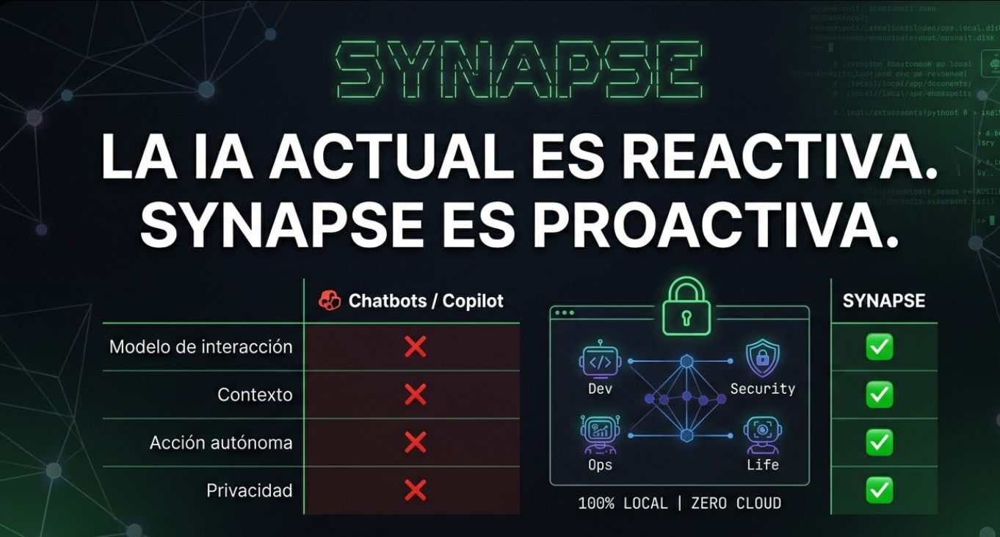
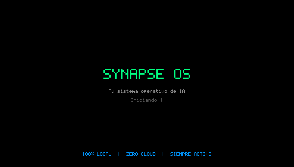

<div align="center">



**Tu sistema operativo de IA. Siempre activo. 100% local. Sin que le pidas nada.**

[](https://python.org)
[](LICENSE)
[](#privacidad)

*"No le di ningún comando. Vio que tenía 3 deadlines, reorganizó mi agenda, preparó el contexto del código y redactó los emails. Solo."*

[Ver demo →](#demo) · [Instalación rápida](#instalación) · [Arquitectura](#arquitectura) · [Roadmap](#roadmap)

</div>

---

## ¿Qué es Synapse?

Los agentes de IA actuales esperan órdenes. Tú escribes, ellos ejecutan. Fin.

**Synapse hace lo contrario.**

Observa tu entorno digital en tiempo real —pantalla, apps abiertas, ficheros, calendario, código— y actúa por ti antes de que lo pidas. No es un asistente. Es una capa de inteligencia que vive encima de tu sistema operativo.

```
Agentes actuales:   Tú → "Hazme X"  →  Agente ejecuta X
Synapse:            Synapse observa → Synapse decide → Synapse actúa
```

Y lo hace sin enviar ni un byte a ninguna nube.

---

## Demo

<div align="center">
  
</div>

> Synapse detecta un cambio en `auth.py`, activa los agentes Dev y Security, coordina via LangGraph, y notifica en el HUD — todo sin escribir un solo comando.

**Ejemplo real:**

```
09:14  Synapse detecta: auth.py modificado (JWT validation)
09:14  Dev Agent:       "Se añadió validación JWT — revisar expiración de tokens"
09:14  Security Agent:  "Sin credenciales hardcodeadas detectadas ✓"
09:14  Tú:              estabas tomando café
```

---

## ¿Por qué Synapse es diferente?

| | Copilot / ChatGPT | Agentes actuales | Synapse |
|---|---|---|---|
| **Modelo de interacción** | Tú preguntas | Tú ordenas | Synapse observa |
| **Contexto** | Tu mensaje | Lo que defines | Todo tu entorno |
| **Memoria** | Ninguna | Por sesión | Persistente siempre |
| **Privacidad** | Sus servidores | Sus servidores | Tu máquina |
| **Acción autónoma** | No | Parcial | Sí, proactiva |

---

## Capacidades del MVP (v0.1)

### 🧠 Memoria persistente
Recuerda todo lo que haces. Aprende tus patrones. Nunca repites contexto.

```bash
synapse query "¿en qué estaba trabajando ayer a las 4pm?"
# → "Estabas en auth.py, debugging el flujo OAuth,
#    con 3 tabs sobre JWT refresh tokens"
```

### 👁️ Contexto global en tiempo real
No solo tu editor. Entiende todo lo que tienes abierto.

- **File watcher** → cambios en código con preview automático
- **Screen context** → app activa, cambios de foco
- **VS Code** → workspace actual, archivos recientes

### 🤖 Agentes autónomos
Cuatro agentes especializados coordinados por un orquestador LangGraph:

- **Dev Agent** — analiza cambios de código, detecta patrones
- **Security Agent** — detecta credenciales y secretos en ficheros
- **Ops Agent** — monitoriza CPU, RAM, disco
- **Life Agent** — detecta fatiga cognitiva por cambios de contexto excesivos

### 🔒 Zero cloud — privacidad radical

```yaml
# config: cloud APIs desactivadas por defecto
privacy:
  cloud_apis: false
  local_model: "mistral"   # corre en tu máquina via Ollama
  telemetry: false
  data_location: "~/.synapse/memory"
```

---

## Arquitectura

```
┌─────────────────────────────────────────────────────────┐
│                    PERCEPTION LAYER                      │
│    File Watcher · Screen Capture · VS Code Context       │
└──────────────────────┬──────────────────────────────────┘
                       │ SynapseEvent
┌──────────────────────▼──────────────────────────────────┐
│                    EVENT BUS (asyncio)                   │
└──────────────────────┬──────────────────────────────────┘
                       │
┌──────────────────────▼──────────────────────────────────┐
│              ORCHESTRATOR (LangGraph)                    │
│         ingest → route → dispatch → emit                 │
└──────┬──────────┬──────────┬──────────┬─────────────────┘
       │          │          │          │
  ┌────▼──┐  ┌───▼───┐  ┌───▼───┐  ┌───▼──────┐
  │  Dev  │  │ Life  │  │  Ops  │  │ Security │
  │ Agent │  │ Agent │  │ Agent │  │  Agent   │
  └────┬──┘  └───┬───┘  └───┬───┘  └───┬──────┘
       └──────────┴──────────┴──────────┘
                       │
┌──────────────────────▼──────────────────────────────────┐
│                   MEMORY LAYER (local)                   │
│    ChromaDB (semántica) · SQLite (episódica)             │
└─────────────────────────────────────────────────────────┘
                       │
              ┌────────▼────────┐
              │   HUD OVERLAY   │
              │  (PyQt6, siempre│
              │   visible)      │
              └─────────────────┘
```

**Stack:**
- **Backend:** Python 3.11 + asyncio
- **Orquestación:** LangGraph
- **LLM local:** Mistral / LLaMA 3 / Phi-3 via [Ollama](https://ollama.ai)
- **Memoria:** ChromaDB (vectores) + SQLite (episódica)
- **Percepción:** watchdog + mss + PyGetWindow
- **Interfaz:** PyQt6 (overlay) + Typer (CLI)

---

## Instalación

**Requisitos:** Python 3.11+, [Ollama](https://ollama.ai) instalado y corriendo

```bash
# 1. Clonar
git clone https://github.com/tu-usuario/synapse
cd synapse

# 2. Instalar
pip install -e .

# 3. Descargar modelo local
ollama pull mistral

# 4. Configurar (opcional)
cp .env.example .env
# editar .env: WATCH_PATHS=~/tu-proyecto

# 5. Arrancar
synapse start

# Synapse ya está observando. No necesitas hacer nada más.
```

---

## Comandos CLI

```bash
synapse start              # Iniciar con HUD overlay
synapse start --no-hud     # Iniciar solo en background

synapse status             # Ver actividad reciente
synapse query "texto"      # Consultar memoria semánticamente
synapse reset-memory       # Limpiar toda la memoria
```

---

## Configuración

```yaml
# .env (copia de .env.example)

OLLAMA_MODEL=mistral          # o llama3, phi3, deepseek-coder
WATCH_PATHS=~/projects        # paths separados por comas
HUD_ENABLED=true
AUTO_ACT=false                # true = actúa sin confirmar (avanzado)
MEMORY_RETENTION_DAYS=90
```

---

## Roadmap

### v0.1 — MVP (actual)
- [x] Arquitectura de agentes (LangGraph)
- [x] Memoria persistente (ChromaDB + SQLite)
- [x] Dev Agent: análisis de código
- [x] Security Agent: detección de credenciales
- [x] Ops Agent: métricas de sistema
- [x] Life Agent: seguimiento de foco
- [x] HUD overlay (PyQt6)
- [x] Demo GIF

### v0.2 — Contexto global
- [ ] Screen reader con OCR completo
- [ ] Life Agent: integración calendario local
- [ ] Plugin VS Code nativo
- [ ] Memoria semántica de hábitos

### v0.3 — Autonomía
- [ ] Acciones autónomas sin confirmación (opt-in)
- [ ] API pública para extensiones de terceros
- [ ] Soporte macOS / Linux completo

> 💬 Vota las features en [Issues → Feature Requests](../../issues?q=label%3A"feature+request")

---

## Contribuir

```bash
git clone https://github.com/tu-usuario/synapse
cd synapse
pip install -e ".[dev]"
pytest tests/
```

Las contribuciones más necesarias ahora:
- Screen reader con OCR (Windows + macOS)
- Nuevos agentes especializados
- Tests de integración end-to-end

Ver [CONTRIBUTING.md](CONTRIBUTING.md) para la guía completa.

---

## Privacidad

Synapse está diseñado desde el principio para no salir de tu máquina.

- ✅ Todos los modelos corren localmente via Ollama
- ✅ Memoria en `./data/` (SQLite + ChromaDB local)
- ✅ Sin telemetría, sin analytics, sin tracking
- ✅ Sin cuenta ni registro
- ✅ 100% open source y auditable

Las APIs externas (OpenAI, etc.) son opt-in explícito y nunca están activas por defecto.

---

## Licencia

MIT — úsalo, modifícalo, distribúyelo. Ver [LICENSE](LICENSE).

---

<div align="center">

¿Te parece interesante? Dale una ⭐ — ayuda a que más gente lo encuentre.

[Issues](../../issues) · [Discussions](../../discussions)

*Construido con la idea de que la IA debería trabajar para ti, no al revés.*

</div>
